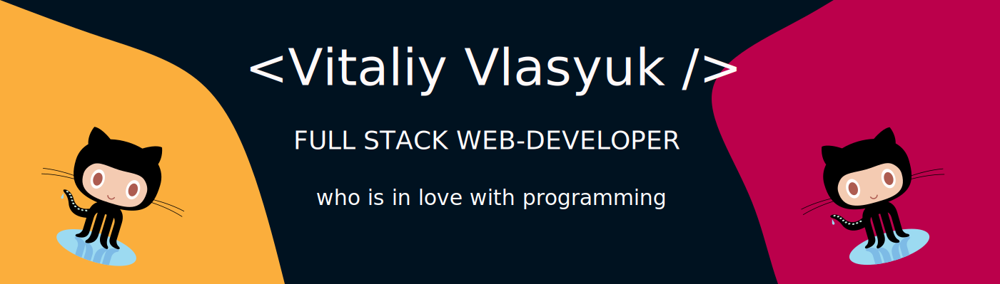

## About me


<p>My name is Vitaliy and I enjoy this ). Technology has always been a major interest in my life, and to combine a modern web-technologies to create solutions for real-life problems is like creating a piece of art for me.</p>

[](https://www.linkedin.com/in/vitaliy-v-6a2a6943)
[](https://www.codewars.com/users/hkzone)

## Technologies

```javascript
const vitaliy = {
	technologies: {
		language: 'Javascript',
		frontEnd: ['SCSS', 'HTML', 'CSS', 'Bootstrap', 'JQuery',],
		backEnd: ['Node.js', 'Express.js', 'MongoDB'],
		tools: [
			'Webpack',
			'Parcel',
			'Jest',
			'Postman',
			'Npm',
			'Git',
			'GitHub',
			'Heroku',
		],
		currentlyLearning: 'React'
	},
};
```
## Stats
<p></p>
